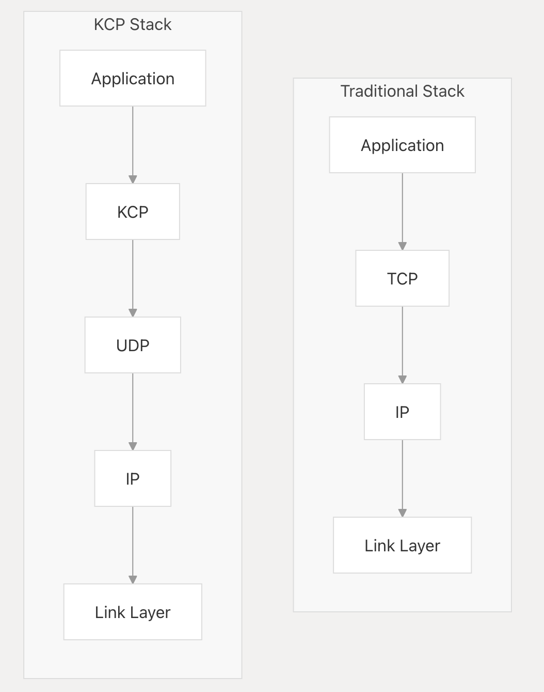

# KCP - A Fast and Reliable ARQ Protocol

## Source

https://github.com/skywind3000/kcp/blob/ec72e3471576563e2ff6898ebca716c9f66fd77b/README.en.md

## **What is KCP?**

KCP is a lightweight, reliable ARQ protocol designed to operate over unreliable transport protocols such as UDP



KCP sits between the application layer and UDP, providing reliability mechanisms while leveraging UDP's low-overhead packet delivery. This architecture allows KCP to implement custom reliability algorithms optimized for latency rather than bandwidth utilization

## **ARQ(Automatic Repeat reQuest) Fundamentals**

The core of KCP is an ARQ (Automatic Repeat Request) mechanism that ensures reliable transmission over unreliable networks. The basic operation principles include:

1. **Sequence numbering**: Each packet (segment) is assigned a sequence number
2. **Acknowledgments**: Receiver confirms receipt of packets by sending acknowledgments
3. **Retransmission**: Sender retransmits packets that aren't acknowledged within a certain time
4. **Windowing**: Limits the number of unacknowledged packets to control flow

## **Comparison with TCP**

1. **More aggressive RTO (round-trip timeout) calculation**

TCP timeout calculation is RTOx2 (exponential), so three consecutive packet losses will make it RTOx8, which is very terrible, while after KCP fast mode is enabled, it is not x2, but x1.5 (Experimental results show that the value of 1.5 is relatively good), which has improved the transmission speed.

1. **Selective retransmission**

**TCP approach**: When packet loss occurs, retransmits all packets from the lost one to the most recent

**KCP approach**: Only retransmits the specific packets that were actually lost

1. **Fast retransmission**

The transmitting terminal sends 1, 2, 3, 4 and 5 packets, and then receives the remote ACK: 1, 3, 4 and 5, when receiving ACK3, KCP knows that 2 is skipped 1 time, and when receiving ACK4, it knows that 2 is skipped 2 times, at this point, it can consider that 2 is lost, without waiting until timeout, it will directly retransmit packet 2, which can greatly improve the transmission speed when packet loss occurs.

1. **Configurable ACK delay**

**TCP approach**: Typically delays ACKs to reduce overhead, which increases RTT estimates and slows down loss detection

**KCP approach**: Makes ACK delay configurable, allowing immediate ACKs when low latency is critical

1. **Optional congestion control**

## Pros & Cons

- Pros:
    - Lower latency

  > **30–40% reduction in average latency**
  >
    - Customizable configuration
- Cons:
    - Manual configuration
    - Higher bandwidth

  > *costing 10–20% additional bandwidth overhead*
  >
    - Higher desync risk

## Questions

1. Should we encrypt UDP traffic? And what does it cost?

http://ithare.com/udp-for-games-security-encryption-and-ddos-protection/

2. How to use TLS over KCP(wrapped UDP)?

https://www.rfc-editor.org/rfc/rfc6347

```
However, TLS
   must run over a reliable transport channel -- typically TCP [TCP].
   Therefore, it cannot be used to secure unreliable datagram traffic.
```

```
An increasing number of application layer protocols have been
   designed that use UDP transport.  In particular, protocols such as
   the Session Initiation Protocol (SIP) [SIP] and electronic gaming
   protocols are increasingly popular.
```